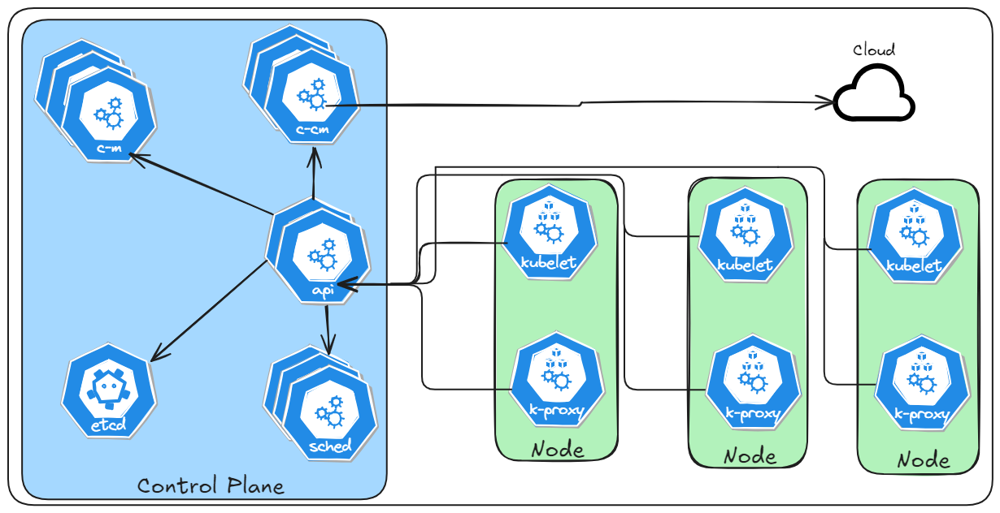
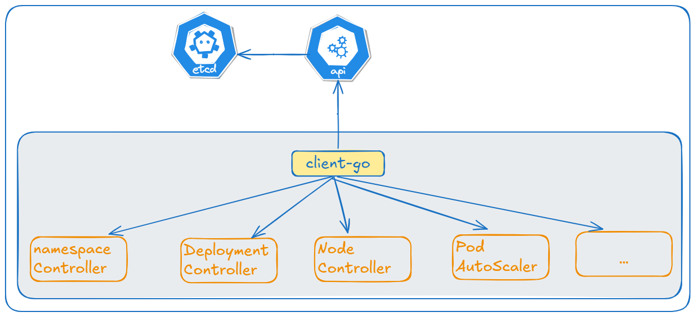

---
## 组合

### `Pod`、`Deployment` & `Service`


Service与其后端Pod副本集群之间则是通过Label Selector实现无缝对接的， Deployment实际上用于保证Service的服务能力和服务质量始终符合预期标准。


---

## `pod`
Pod 是 `Kubernetes` 中最小的可部署单元， 中文可以翻译为“容器组”。它是用于承载和管理容器的抽象层。 一个 Pod 可以包含一个或多个紧密关联的容器， 它们共享相同的网络命名空间、 IP 地址和存储卷， 并在同一个宿主机上运行。


## `node`

`Node`是一个运行着`Kubernetes`节点软件的物理机器或虚拟机。 每个Node负责运行 Pod中的容器， 并由`Kubernetes`控制平面管理。`Node`是`Kubernetes`集群中的工作节点， 它实际执行应用程序工作负载并提供运行环境。


## `kubelet`

`kubelet` 是`Kubernetes`系统中的一个核心组件， 负责管理和维护每个节点上的`Pod`， 并确保它们按照预期运行。 `kubelet`在节点上运行， 并与`Kubernetes`控制平面进行通信， 以确保节点上的Pod与集群中的其他组件保持同步


## `kube-proxy`

`Kube-proxy`是`kubernetes`中网络核心组件， 实现了服务暴露和转发等网络功能。 支持用户空间模式， `ipvs`和`iptables`三种代理模式。 用户空间模式性能问题较严重， 基本不再使用， 应用最多的是`iptables`和`ipvs`模式。


---



## `api-server(api)`

`api-server`是集群的核心， 是`k8s`中最重要的组件， 因为它是实现声明式`api`的关键。 `kubernetes api-server`的核心功能是提供了`Kubernetes`各类资源对象 （`pod`、 `RC` 、 `service`等） 的增、 删、 改、 查以及watch等HTTP REST接口。


## `Controller-Manager(c-m)`

`Controller Manager` 的作用简而言之： 保证集群中各种资源的实际状态（status） 和用户定义的期望状态 （spec） 一致。官方定义： `kube-controller-manager` 运行控制器，它们是处理集群中常规任务的后台线程。

## `etcd`

`etcd`是兼具一致性和高可用性的键值数据库， 可用于服务发现以及配置中心。 采用 raft一致性算法， 基于Go语言实现。 是保存`Kubernetes` 所有集群数据的后台数据库， 在整个云原生中发挥着极其重要的作用。


## `kube-scheduler(sched)`

`kube-scheduler` 是`kubernetes` 系统的核心组件之一， 主要负责整个集群资源的调度功能， 根据特定的调度算法和策略， 将`Pod`调度到最优的工作节点上面去， 从而更加合理、 更加充分地利用集群的资源。


---


## `Deployment(deploy)`

`Deployment` 是一种Pod 管理方式， 它可以指挥`Kubernetes `如何创建和更新你部署的应用实例， 创建Deployment 后， `Kubernetes master `会将应用程序调度到集群中的各个节点上， 一般用来部署无状态应用。

 `Deployment` 用模板的思路，即提供一个Pod模板（Template），然后由程序根据我们指定的模板自动创建指定数量的Pod实例。

在创建好Deployment之后， Kubernetes会根据这一定义创建符合要求的Pod， 并且通过在Deployment中定义的Label筛选出对应的Pod实例并实时监控其状态和数量。 如果实例数量少于定义的副本数量， 则会根据在Deployment对象中定义的Pod模板创建一个新的Pod， 然后将此Pod调度到合适的Node上启动运行， 直到Pod实例的数量达到预定目标。

- 服务扩容以至服务升级


## `StatefulSet(sts)`
`StatefulSet` 是用来管理有状态应用的工作负载` API` 对象。`StatefulSet` 用来管理某 `Pod` 集合的部署和扩缩， 并为这些 `Pod` 提供持久存储和持久标识符。


## `ReplicaSet(rs)`

`ReplicaSet` 的目 的是维护一组在任何时候都处于运行状态的 Pod 副本的稳定集合。因此，它通常用来保证给定数量的、 完全相同的 Pod 的可用性。


## `DaemonSet(ds)`

DaemonSet 确保全部 （或者某些） 节点上运行一个 Pod 的副 本。 当有节点加入集群时， 也会为他们新增一个 Pod 。 当有节点从集群移除时， 这些Pod 也会被回收。 删除 DaemonSet 将会删除它创建的所有 Pod。


## `svc`

Service 是将运行在一个或一组 Pod 上的网络应用程序公开为网络服务的方法


查看 `svc` 中 集群 `IP` 向 `Endpoint` 的匹配关系
```bash
[root@k8smaster-ims ~]# kubectl describe svc prometheus-k8s -n base-services
Name:                     prometheus-k8s
Namespace:                base-services
Labels:                   app.kubernetes.io/component=prometheus
                          app.kubernetes.io/name=prometheus
                          app.kubernetes.io/part-of=kube-prometheus
                          app.kubernetes.io/version=2.26.0
                          prometheus=k8s
Annotations:              <none>
Selector:                 app.kubernetes.io/component=prometheus,app.kubernetes.io/name=prometheus,app.kubernetes.io/part-of=kube-prometheus,app=prometheus,prometheus=k8s
Type:                     NodePort
IP Family Policy:         SingleStack
IP Families:              IPv4
IP:                       10.96.2.144
IPs:                      10.96.2.144
Port:                     web  9090/TCP
TargetPort:               9090/TCP
NodePort:                 web  30090/TCP
Endpoints:                100.66.218.147:9090
Session Affinity:         ClientIP
External Traffic Policy:  Cluster
Events:                   <none>
```


## `Endpoint(ep)`

Endpoint是k8s集群中的一个资源对象， 存储在etcd中， 用来记录一个Service对应的所有Pod的访问地址。 Service配置selector， Endpoint Controller才会自 动创建对应的Endpoint对象；


## `Ingress(ing)`

Ingress 是对集群中服务的外部访问进行管理的 API 对象， 典型的访问方式是 HTTP。 可以通过Ingress资源来配置不同的转发规则， 从而达到根据不同的规则设置访问集群内不同的Service所对应的后端Pod。


## `ConfigMap(cm)`

ConfigMap是一种 API 对象， 用来将非机密性的数据保存到键值对中。 使用时， Pod 可以将其用作环境变量、 命令行参数或者存储卷中的配置文件。ConfigMap 将你的环境配置信息和容器镜像解耦， 便于应用配置的修改。


## `Secret`

Secret 是一种包含少量敏感信息例如密码、 令牌或密钥的对象。 这样的信

息可能会被放在 Pod 规约中或者镜像中。


## `namespace(ns)`

命名空间 （namespace） 提供一种机制， 将同一集群中的资源划分为相互隔离的组， 以便进行分类、 筛选和管理。

同一命名空间内的资源名称要唯一， 但跨命名空间时没有这个要求。


## `Volume(vol)`
卷 （Volume） 用于 Pod 内部的数据存储， Pod 容器内部数据是可以共享

的， 其生命周期与所属 Pod 生命周期相同


## `PersistentVolume(pv)`

持久卷 （PersistentVolume） 是集群中由管理员配置的一段网络存储。 它是集群中的资源， 就像节点是集群资源一样。 PV持久卷和普通的Volume一样， 也是使用卷插件来实现的， 只是它们拥有独立于任何使用 PV的Pod的生命周期

## `StorageClass(sc)`

StorageClass 为管理员提供了描述存储"类"的方法。 不同的类型可能会映射到不同的服务质量等级或备份策略， 或是由集群管理员制定的任意策略。Kubernetes 本身并不清楚各种类代表的什么。

这个类的概念在其他存储系统中有时被称为"配置文件"。

### `PersistentVolumeClaim(pvc)`

持久卷申领 （PersistentVolumeClaim） 表达的是用户对存储的请求。 概念上与Pod类似。 Pod会耗用节点资源， 而 PVC申领会耗用 PV资 源。 Pod可以请求特定数量的资源 （CPU 和内存）； 同样 PVC 申领也可以请求特定的大小和访问模式。

```yaml
apiVersion: v1
kind: PersistentVolume
metadata:
  name: prometheus-storage-pv
  namespace: base-services
spec:
  storageClassName: prometheus-db-vol
  persistentVolumeReclaimPolicy: Retain
  capacity:
    storage: 30Gi
  accessModes:
    - ReadWriteOnce
  hostPath:
    path: /opt/prometheus
---
apiVersion: v1
kind: PersistentVolumeClaim
metadata:
  name: prometheus-db
  namespace: base-services
spec:
  storageClassName: prometheus-db-vol
  accessModes:
    - ReadWriteOnce
  resources:
    requests:
      storage: 1Gi
```

Pod中的使用
```yaml
spec:
  replicas: 2
  volumes:
    - name: prometheus-pv-storage
      persistentVolumeClaim:
        claimName: prometheus-db
  containers:
  - name: prometheus
    volumeMounts:
    - name: prometheus-pv-storage
      mountPath: /prometheus
```

## `NetworkPolicy(netpol)`

如果你希望在 IP 地址或端口层面 （OSI 第 3 层或第 4 层） 控制网络流量，则你可以考虑为集群中特定应用使用 Kubernetes 网络策略。NetworkPolicy 是一种以应用为中心的结构， 允许你设置如何允许 Pod 与网络上的各类网络实体通信。


## `Job`
job主要是针对短时和批量的一次性任务。 它是为了结束而运行的， 而不是像Deployment、 ReplicaSet、 Replication Controller和DaemonSet等其他对象那样持续运行。


## `CronJob`

CronJob负责定时任务， 在指定的时间周期运行指定的任务。


---
*RABC*
## `Role`

总是用来在某个名字空间 （namespace） 内设置访问权限； 在你创建 Role

时， 你必须指定该 Role 所属的名字空间。

## `ClusterRole(c.role)`
ClusterRole 是一个集群级别的 PolicyRule 逻辑分组， 可以被

RoleBinding 或 ClusterRoleBinding 作为一个单元引用。


## `RoleBinding(rb)`

角色绑定 （RoleBinding） 是将角色中定义的权限赋予一个或者一组用户。它包含若干主体 （用户、 组或服务账户） 的列表和对这些主体所获得的角色的引用。 RoleBinding 在指定的名字空间中执行授权， 而ClusterRoleBinding 在集群范围执行授权。

## `ClusterRoleBinding(crb)`

CRB是 Kubernetes 中的一种对象， 它将一个 ClusterRole 绑定到一组用户、 服务帐户或组中， 从而授权它们可以执行某些操作。 CRB 是一种集群范围的资源， 它可以授权整个集群中的所有命名空间。

## `User`

所有 Kubernetes 集群都有两类用户： 由 Kubernetes 管理的服务账号（ServiceAccount） 和普通意义上的用户 （User）。

User通常是人来使用， 而 ServiceAccount是某个服务/资源/程序使用的


## `ServiceAccount(sa)`
服务账号 （ServiceAccount） 为 Pod 中运行的进程提供身份标识， 并映射到 ServiceAccount 对象。 当你向 API 服务器执行身份认证时， 你会将自己标识为某个用户 （User）。

## `Group`
用户组， 取值为一组字符串， 其中各个字符串用来标明用户是某个命名的用户逻辑集合的成员。 常见的值可能是 system:masters 或者 devops-team等。


---

## `ResourceQuota(quota)`

资源配额， 通过 ResourceQuota 对象来定义， 对每个命名空间的资源消耗总量提供限制。 它可以限制命名空间中某种类型的对象的总数目 上限， 也可以限制命名空间中的 Pod 可以使用的计算资源的总上限。

## `Limits`

Kubernetes将Limits定义为一个容器使用的最大资源量。 这意味着容器的

消耗量永远不能超过指定的内存量或CPU量


## `HorizontalPodAutoScaler(hpa)`

HPA是kubernetes的一种资源对象， 能够根据某些指标对在StatefulSet、Deployment等资源对象中的Pod数量进行动态伸缩， 使运行在上面的服务对指标的变化有一定的自 适应能力。

## `Cloud-Controller-manager(c-c-m)`

cloud-controller-manager 是指云控制器管理器， 一个 `Kubernetes` 控制平面组件， 嵌入了特定于云平台的控制逻辑。 云控制器管理器允许你将你的集群连接到云提供商的 API 之上， 并将与该云平台交互的组件同与你的集群交互的组件分离开来。


## `CustomResourceDefine(crd)`
CustomResourceDefine 简称CRD， 是Kubernetes （v1.7+） 为提高可扩展性， 让开发者去自 定义资源的一种方式。 CRD 资源可以动态注册到集群中， 注册完毕后， 用户可以通过kubectl 来创建访问这个 自 定义的资源对象， 类似于操作Pod 一样。


## `PodSecurityPolicy(psp)`

Pod 安全策略， 在Kubernetes1.21版本中被标记启用， 在1.25版本移除。作为替代， 可以使用 Pod安全标准 （PodSecurityStandard）或者自 行部署第三方准入插件。