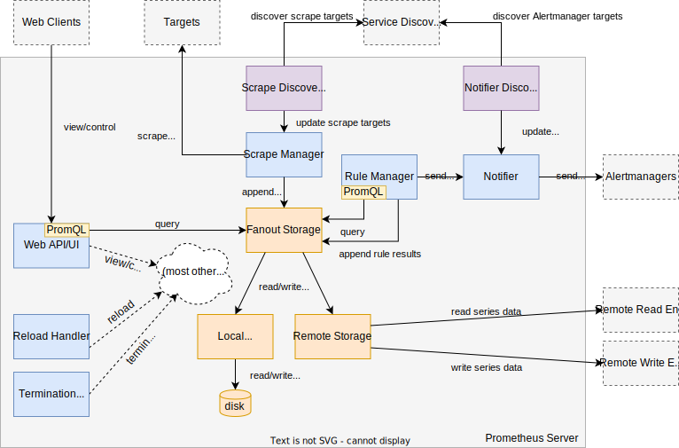

外部架构图


内部架构图




## 信息查看


### 查看配置

通过访问网址 : `ip:port/config` 即可查看启动状态下的 `prometheus` 的配置

```bash
http://10.161.40.240:30090/config
```


up{job="kubelet"}


- kube state metrics 指标

```plaintext
sum(kube_pod_container_status_restarts_total) by (pod)
sum(kube_pod_status_phase{phase!="Running"}) by (namespace, phase)
```


```bash
# 报警规则目录
# alertmanager.yaml要用kubectl create secret generic alertmanager-main --from-file=alertmanager.yaml -n base-services这样加进去
/opt/YsP-1/wp/prometheus/
```


prometheus的服务发现：

[服务发现](https://yunlzheng.gitbook.io/prometheus-book/part-iii-prometheus-shi-zhan/readmd/service-discovery-with-kubernetes)


## `prometheus operator`


在没有使用 `prometheus operator` 的环境中如果想配置 `prometheus` 的监控资源需要配置 `prometheus.yaml` 文件，在使用 `promeheus operator` 的环境中可以直接声明一个 `ServiceMonitor` 对象。


```yaml
apiVersion: monitoring.coreos.com/v1  
kind: ServiceMonitor  
metadata:  
  labels:  
    app.kubernetes.io/name: kube-state-metrics  
    app.kubernetes.io/version: 1.9.5  
  name: kube-state-metrics  
  namespace: base-services  
spec:  
  endpoints:  
  - bearerTokenFile: /var/run/secrets/kubernetes.io/serviceaccount/token  
    honorLabels: true  
    interval: 5s  
    port: https-main  
    relabelings:  
    - action: labeldrop  
      regex: (pod|service|endpoint|namespace)  
    scheme: https  
    scrapeTimeout: 5s  
    tlsConfig:  
      insecureSkipVerify: true  
  - bearerTokenFile: /var/run/secrets/kubernetes.io/serviceaccount/token  
    interval: 5s  
    port: https-self  
    scheme: https  
    tlsConfig:  
      insecureSkipVerify: true  
  jobLabel: app.kubernetes.io/name  
  selector:  
    matchLabels:  
      app.kubernetes.io/name: kube-state-metrics
```


<<<<<<< HEAD
## `kube-promethsu`


- 使用 `kube-prometheus` 安装 `prometheus`
```bash
$ kubectl apply -f manifests/setup
$ kubectl apply -f manifests/
```

- 从集群中删除 `prometheus`

```bash
$ kubectl delete --ignore-not-found=true-f manifests/ -f manifests/setup
```

- 或者为了简单可以使用 `-Rf` 参数进行 `apply` 但是可能需要执行多次，因为有些 `components` 之间是有依赖的

```bash
$ kubectl apply --server-side -Rf manifests
```


启动 `promehteus` 

```bash
kubectl create -f setup/  
kubectl create -f ./
```
=======


### 数据类型


- `vector` 一组时间序列，所有时间序列共享时间戳，prometheus界面进行table查询的结果，path是 `/api/v1/query`，返回 resultType是vector
- `Metrix` 也叫 `range vector` 是一组时间序列，一段时间内的结果，对应界面上的 graph 查询，对应的查询接口是 `/api/v1/query_range` 
- `scalar`  table界面查询，查询数据是整数或者浮点数时，查询接口是：  `/api/v1/query`
- `string` 字符串类型


>>>>>>> ab486d3337d20f9aa163b786caeec42c798bce40


## node_export 

- node export 支持黑白名单，可以裁减掉部分指标的采集，这样才能降低之对主机性能的消耗
- 支持采集指定目录下符合指标标准的数据
- prometheus可以通过 `param` 配置指定 `node_export` 采集哪些数据，相当于prometheus采集数据时可以指定白名单